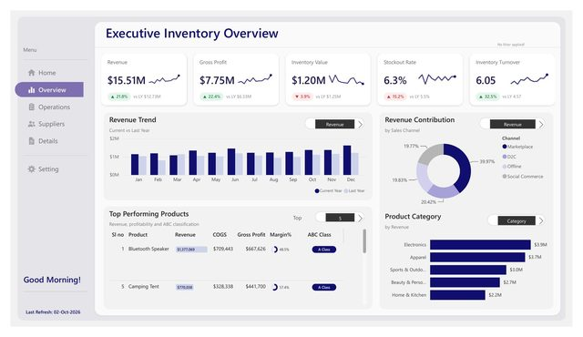
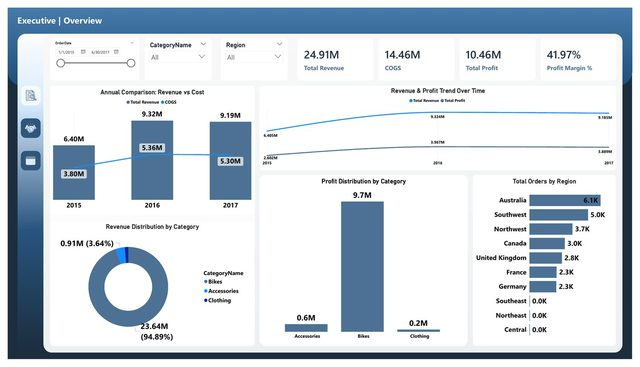
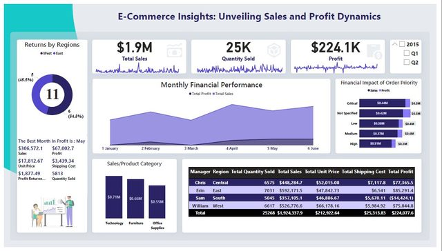
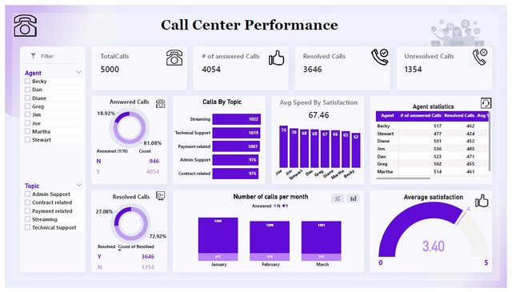
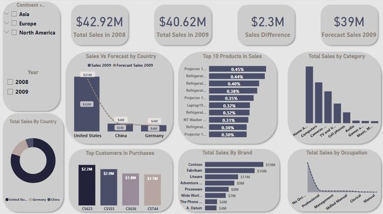
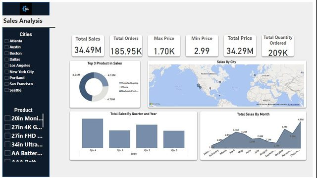
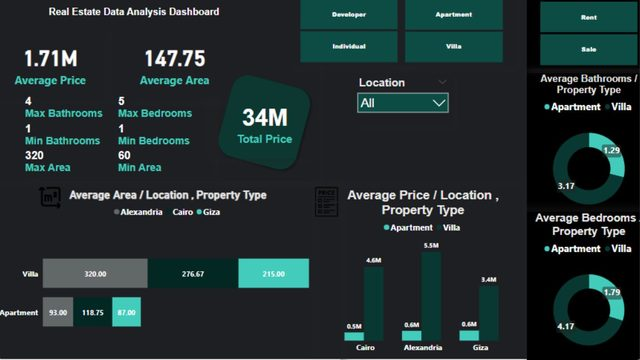

  

<h1 align="center">Hi, I'm Youssef Saeed 👋</h1>

  

  
  
  

---

Data and analytics leader with 5+ years across **pharma, insurance, fintech, automotive and poultry**. I lead analytics from business problem to measurable ROI, partner with leadership on the KPIs that matter, and mentor the team behind the data models, pipelines and Power BI reports people trust.

- 💼 **Now:** Data Analytics Tech Lead at **Eva Pharma**
- 🌍 **Community:** Community Manager at **People of Data**, 15+ meetups organized
- 🎤 **Speaking:** Panelist, *AI Without Limits* at Google I/O Extended New Cairo
- 👨‍🏫 **Teaching:** 300+ learners taught in data analytics, Excel and Power BI
- 🎓 **Studying:** Pre‑Master in Data Science, Cairo University

## 🛠 Tech stack

**BI & Visualization**
 

**Data, Cloud & Automation**
 

**Code & AI**
 

## 📊 Featured Power BI projects

Every project starts from a business question. Full report pages and details are in **[powerbi-projects](https://github.com/YoussefSaeed1/powerbi-projects)**.

<table>
  <tr>
    <td width="50%" valign="top">
      
      <b>Inventory Management</b> 
      Revenue is up 21.8%, so why are stockouts rising? 4 report pages, ABC classification.
    </td>
    <td width="50%" valign="top">
      
      <b>Sales Tracker</b> 
      $24.91M revenue at 41.97% margin, and bikes bring in almost 95% of it.
    </td>
  </tr>
  <tr>
    <td width="50%" valign="top">
      
      <b>E‑Commerce Sales &amp; Profit</b> 
      Which regions sell well but don't make money? The South sold $357K and lost $14.4K.
    </td>
    <td width="50%" valign="top">
      
      <b>Call Center Performance</b> 
      5,000 calls: 81% answered, 73% resolved, satisfaction 3.4 / 5.
    </td>
  </tr>
  <tr>
    <td width="50%" valign="top">
      
      <b>Sales and Forecast</b> 
      2009 sales came in $2.3M below 2008 but above the $39M forecast.
    </td>
    <td width="50%" valign="top">
      
      <b>Sales Analysis</b> 
      $34.49M from 186K orders; December peaks at $4.6M.
    </td>
  </tr>
  <tr>
    <td width="50%" valign="top">
      
      <b>Egypt Real Estate Market</b> (Python + Power BI) 
      Alexandria villas average 5.5M, the highest of any location and type.
    </td>
    <td width="50%" valign="top">
      <b>🎾 Side project: CourtFit</b> 
      My own Push / Pull / Legs + tennis training app. Installable PWA that works offline, with exercise photos, progress tracking and an Arabic version.  
      <a href="https://github.com/YoussefSaeed1/courtfit">Code</a> · <a href="https://youssefsaeed1.github.io/courtfit/">Open the app</a>  
      More below in <a href="#-all-repositories">All repositories</a>.
    </td>
  </tr>
</table>

## 🗂 All repositories

Updated automatically every 6 hours by a GitHub Action.

<!-- REPOS:START -->
| Repository | What it is | Language | Updated |
|---|---|---|---|
| [**courtfit**](https://github.com/YoussefSaeed1/courtfit) | CourtFit: Push/Pull/Legs + tennis training app (installable PWA, works offline) | 🌐 HTML | Oct 2026 |
| [**portfolio**](https://github.com/YoussefSaeed1/portfolio) · [live](https://youssefsaeed1.github.io/portfolio/) | Personal portfolio website: Power BI projects, skills, experience and speaking | 🌐 HTML | Oct 2026 |
| [**ERD-Kiwilytics-Project**](https://github.com/YoussefSaeed1/ERD-Kiwilytics-Project) | Entity Relationship Diagram for a sales and order-management database | — | Oct 2026 |
| [**Heart_Disease_Project**](https://github.com/YoussefSaeed1/Heart_Disease_Project) | This project analyzes heart disease patient data to predict the risk of heart disease using machine learning techniques. It includes data preprocessing, dimensionality reduction (PCA), feature selection, supervised & unsupervised learning, hyperparameter tuning, and a Streamlit web app for interactive predictions. | 📓 Jupyter Notebook | Oct 2026 |
| [**powerbi-projects**](https://github.com/YoussefSaeed1/powerbi-projects) | Power BI dashboards built around business questions, with findings and full report pages | — | Oct 2026 |
<!-- REPOS:END -->

## 🏅 Certifications

| Certification | Issuer | Date |
|---|---|---|
| [Alteryx Designer Cloud Core](https://www.credly.com/badges/792b4c3d-ff52-42b7-a57c-b40320cbf2e0/public_url) | Alteryx | Aug 2026 |
| [Alteryx Designer Advanced](https://www.credly.com/badges/7b79dbae-6b84-450a-a663-06f352706fa4/public_url) | Alteryx | Oct 2025 |
| [Alteryx Designer Core](https://www.credly.com/badges/0456085b-e18a-488e-b48a-4c21e9bda319/public_url) | Alteryx | Sep 2025 |
| [Certified Data Analyst](https://www.datacamp.com/certificate/DA0020994119176) | DataCamp | May 2025 |
| [Power BI Data Analyst Associate (PL‑300)](https://learn.microsoft.com/en-us/users/youssefsaeed-4554/credentials/e61eb38501cb9e92) | Microsoft | Jan 2025 |
| [Data Analysis Professional Nanodegree](https://www.udacity.com/certificate/F6LP29ZX) | Udacity | Apr 2022 |

---

  Got messy data? Let's talk. · <a href="https://youssefsaeed-portfolio.vercel.app/">youssefsaeed-portfolio.vercel.app</a>

